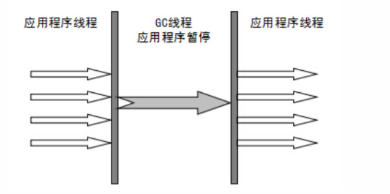
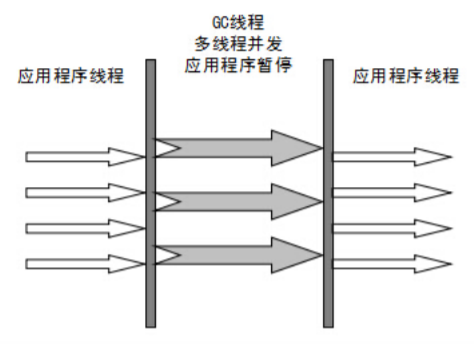
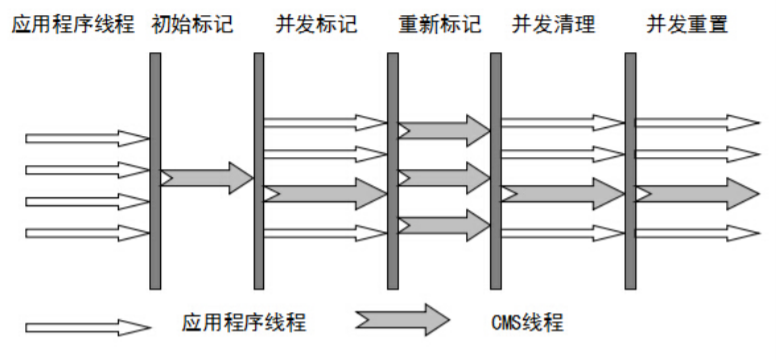

# JVM

[官方文档](https://docs.oracle.com/javase/8/docs/technotes/guides/vm/gctuning/collectors.html#sthref28)

垃圾收集算法

**Serial（串行）收集器（单线程版本）**

`Serial没有线程交互的开销，自然可以有很高的单线程收集效率；Serial对于运行在Client模式下的虚拟机是个很不错的选择`

新生代（采用复制算法）  1.3之前  单线程  会造成（STW）Stop The World

老年代（标记整理算法），针对于老年代垃圾收集

**ParNew收集器【是Serial的多线程版本】**

`它是许多运行在Server模式下的虚拟机的首选，除了Serial收集器外，只有他能与CMS收集器（真正意义上的并发收集器）配合工作`

新生代（采用复制算法）

老年代（标记整理算法）

**Parallel Scavenge收集器**

`关注点是高吞吐（高效利用CPU）`

新生代：采用复制算法

老年代：采用标记整理算法

**CMS（Concurrent Mark Sweep）收集器**【**采用标记清除算法**】

`CMS是一种以获取最短回收停顿时间为目标的收集器，非常符合注重用户体验的应用中使用`

优点：并发收集；低停顿

缺点：

- 对CPU资源敏感
- 无法处理浮动垃圾
- 使用 标记-清除 算法会有大量空间碎片

**G1（Garbage-First）收集器** （JDK1.7引入）

G1收集器是一款面向服务器的垃圾收集器，主要针对配备多颗处理器以及大量内存的机器，以及高概率满足GC停顿时间要求的同时，还具备高吞吐量的特征

