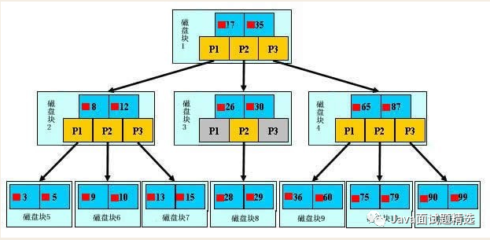

# MySQL索引

[参考文章](https://mp.weixin.qq.com/s/S2utZ3i_Cw46UJEDIXPrTQ)

## MySQL索引

在MySQL中主要有四种索引：

- B-Tree索引
- Hash索引
- FullText索引（MyISAM表）
- R-Tree索引

## Tips：

二分查找【时间复杂度O(logn)】

MySQL 的B+树索引 查找使用了二分查找；

Redis 的跳表也使用了二分查找；

[跳表](https://mp.weixin.qq.com/s/Ok0laJMn4_OzL-LxPTHawQ)
【是一种数据结构】是带有多层索引的有序链表

Kafaka 查询消息日志也使用了二分查找

MySQL使用了B+索引

- B树：有序数组+平衡多叉树
- B+树：有序数组链表+平衡多叉树

## 索引的数据结构

叶子节点只存储真实数据；非叶子节点不存储真实数据，只存储指引搜索方向的数据项

解读：

查找某个值，例：28

根节点有两个代表数据项，指向三个子节点(磁盘块)的指针P1、P2、P3；【P1代表这个磁盘块中数据都小于17；P2代表这个磁盘中数据在17-35之间；P3 代表这个磁盘数据大于35】；17<28<35，所以要在P2指向的磁盘块3(26,30)中找；26<28<30，所以需要在磁盘块3中P2指向的磁盘块8中寻找，最后找到所需数据28.

这样B+树保证每次查询都是一样的效率，因为每次查询都是一样层级的深度遍历